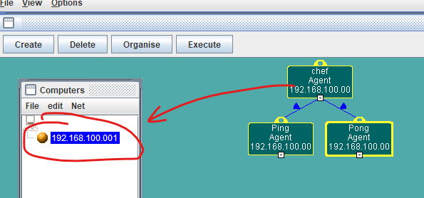
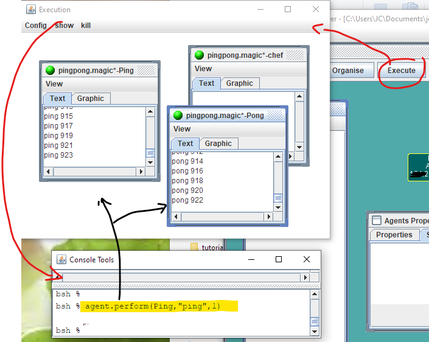

# Magique

La version actuelle de Magique nécessite d'utiliser la version 8 du Java Development Kit.  

Cette version doit être téléchargée [sur le site d'Oracle](https://www.oracle.com/java/technologies/javase/javase8-archive-downloads.html), puis installée. Mémorisez le dossier dans lequel vous ferez cette installation. Nous le noterons par la suite `cheminVersJDK18/`.


## Exemple simple : Pong

Nous allons aborder l'exemple  **Ping-Pong**.
Les codes se trouvent dans le dossier `.../magique/example/pingpong` (et aussi dans le dossier `.../magique/tutorial/exemples/chap2`).


### Exécution distribuée dans des terminaux

Voici comment exécuter ce programme en mode distribué, en exécutant les agents impliqués dans trois terminaux différents du même ordinateur.

Il peut être nécessaire de commencer par compiler les codes fournis

```bash
.../magique/example/pingpong> cheminVersJDK18/bin/javac -classpath .:../../magique18.jar *.java
```

Dans un premier terminal, il faut démarrer l'agent **Superviseur**

```bash
.../magique/example/pingpong> cheminVersJDK18/bin/java -classpath ".;../../magique18.jar" fr.lifl.magique.Start SuperImp
```
On obtient la trace :
```bash
....................................
 Magique : PlatformAgent created
..null
...............
```

Chacun des agents *Ping* et *Pong* doit être démarré dans son propre terminal. Il faut leur indiquer l'adresse du superviseur. Pour cela il faut préciser l'adresse IP et le port d'écoute du superviseur. 

L'adresse IP de l'ordinateur (et donc du superviseurs) peut être obtenue à l'aide de la commande `ifconfig` sous linux, ou `ipconfig` sous windows.

Dans la suite nous supposerons que cette adresse est `192.168.100.001`. Précisons qu'il n'est pas possible d'utiliser l'adresse `127.0.0.1` ni `localhost`.

Le port aura la valeur par défaut 4444 puisque nous n'avons rien précisé lors du démarrage de ce superviseur.

Les agents *Ping* et *Pong* étant exécutés sur le même ordinateur, il va falloir préciser un port d'exécution différent pour chacun d'entre eux. Nous prendrons, arbitrairement, 5555 et 6666.


Ce qui donne pour chacun *Ping* :
```bash
.../magique/example/pingpong> cheminVersJDK18/bin/java -classpath ".;../../magique18.jar" fr.lifl.magique.Start PingImp  5555 192.168.100.001:4444
```
et la trace où apparaît les informations de connexion au superviseur
```bash
....................................
 Magique : PlatformAgent created
..null
................Platform : connect to 134.206.12.150:4444
134.206.12.150:4444 not yet known
134.206.12.150:4444 already known
connection with 134.206.12.150:4444 performed
ping
```
A la fin de cet affichage on voit apparaitre la trace de l'envoi du premier message `ping` en attente de réponse.

Du côté du *superviseur* on peut constater la trace de connexion de l'agent *Ping* avec l'apparition des messages
```bash
...............134.206.12.150:5555 not yet known
connection with 134.206.12.150:5555 performed
```

Il nous reste à démarrer *Pong* de manière similaire :

```bash
.../magique/example/pingpong> cheminVersJDK18/bin/java -classpath ".;../../magique18.jar" fr.lifl.magique.Start PongImp 6666 192.168.100.001:4444
```

On constate alors dans le terminal du superviseur la connexion de l'agent *Pong*, ainsi que dans les terminaux des agents *Ping* et *Ping* l'envoi infini des messages 'ping' et 'pong' entre les deux agents.

Il faut mettre fin à leur partie de ping-pong infinie par `Ctrl C` dans l'un des terminaux.

On peut augmenter le niveau de trace pour voir les messages échangés en ajoutant un paramètre à l'exécution. Le niveau de trace va de 0 à 5 :
```bash
cheminVersJDK18/bin/java -classpath ".;../../magique18.jar" fr.lifl.magique.Start PingImp  5555 192.168.100.001:4444 5
```

(pour le superviseur il devient nécessaire de préciser la valeur du port 4444 avant le niveau de trace).

### Exécution avec l'interface graphique

Il faut démarrrer un agent plateforme :
```bash
.../magique/example/pingpong> cheminVersJDK18/bin/java -classpath ".;../../magique18.jar" fr.lifl.magique.PlatformLauncher
```

Puis l'interface graphique

```bash
.../magique/example/pingpong> cheminVersJDK18/bin/java -cp ".;../../magiqueGUI-18.jar" fr.lifl.magique.gui.LanceurAgents
```

Charger la configuration : menu *File* puis *load* : `pingpong.magic`.

Editer l'adresse IP de l'ordinateur, puis sélectionner cahque agent puis cliquer sur l'hôte pour mettre à jour l'adresse de l'agent.



Cliquer ensuite sur *Execute*, la fenêtre d'exécution s'ouvre et vous pouvez réorganiser les "sous"-fenêtre par agent.

Sélectionnez *Show* puis "Console Tools". Dans la fenêtre qui s'ouvre saisissez :

`agent.perform(Ping,"ping",1)`



et validez pour observer l'exécution.
